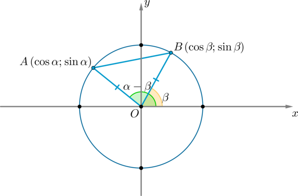

# Cosine of difference

	cos(α-β) = cos(α)*cos(β) + sin(α)*sin(β) ;
	▲
		AB^2 = AO^2 + BO^2 - 2*AO*BO*cos(α-β) =
			= 1 + 1 - 2*cos(α-β) ;
		AB^2 = (cos(α) - cos(β))^2 + (sin(α) - sin(β))^2 =
			= cos(α)^2 - 2*cos(α)*cos(β) + cos(β)^2 +
			+ sin(α)^2 - 2*sin(α)*sin(β) + sin(β)^2 =
			= cos(α)^2 + sin(α)^2 + cos(β)^2 + sin(β)^2 -
			- 2*(cos(α)*cos(β) + sin(α)*sin(β) ) = 
			= 2 - 2*(cos(α)*cos(β) + sin(α)*sin(β));

		2 - 2*cos(α-β) = 2 - 2*(cos(α)*cos(β) + sin(α)+sin(β)) ;

		cos(α-β) = cos(α)*cos(β) + sin(α)*sin(β).
	∎

## Dep
[Law of cosines](../law-of-cosines)

