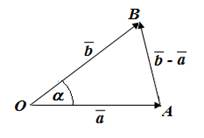

# Dot product

	vec(a)*vec(b) = a*b*cos(φ) ;

	vec(a) = {x1, y1} ;
	vec(b) = {x2, y2} ;
	vec(a)*vec(b) = x1*x2 + y1*y2 ;
	▲
		AB^2 = OA^2 +OB^2 - 2*OA*OB*cos(α) ;

		vec(b) - vec(a) = vec(AB) = {x2-x1, y2-y1} ;

		|vec(b)-vec(a)|^2 = a^2 + b^2 - 2*a*b ;

		vec(a)*vec(b) = 1/2*(a^2 + b^2 - |vec(b)-vec(a)|^2) ;
		
		|vec(a)|^2 = x1^2 + y1^2 ;
		|vec(b)|^2 = x2^2 + y2^2 ;
		|vec(b)-vec(a)|^2 = (x2 - x1)^2 + (y2 - y1)^2 ;

		vec(a)*vec(b) = (x1^2 + y1^2 + x2^2 + y2^2 -
			- (x1^2 + y1^2 + x2^2 + y2^2 - 2*x1*x2 - 2*y1*y2))/2 =
			= x1*x2 + y1*y2 .
	∎
