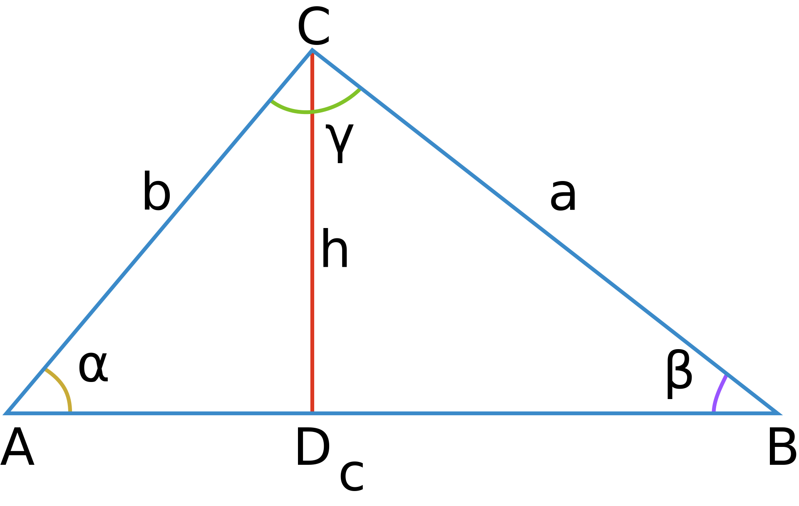

# Теорема косинусов

	a^2 = b^2 + c^2 - 2*b*c*cos(α) ;
	▲
	AD = b * cos(α) ;
	DB = c - b*cos(α) ;
	h^2 = b^2 - (b*cos(α))^2 ;
	h^2 = a^2 - (c - b*cos(α))^2 ;
	b^2 - (b*cos(α))^2 = a^2 - (c - b*cos(α))^2 ;
	a^2 = b^2 - (b*cos(α))^2 + (c - b*cos(α))^2 =
		= b^2 - (b*cos(α))^2 + c^2 - 2*b*c*cos(α) +
		+ (b*cos(α))^2 = b^2 + c^2 - 2*b*c*cos(α) .
	∎
