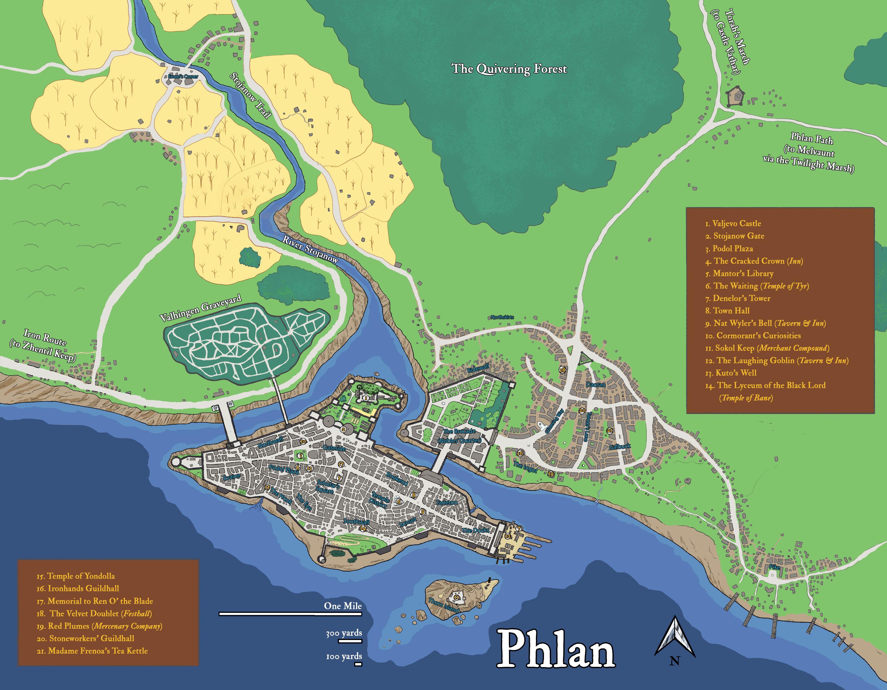

# Phlan/Флан

Флан Phlan, основанный в 367 ЛД воплощает собой непоколебимость людей
и их стремление приносить цивилизацию в дикие места.
С момента основания его много раз разносили на кусочки дикие существа севера,
но он восставал как феникс из собственного пепелища.
Правитель города, ЛОРД ПРОТЕКТОР АНИВАР ДАОРАН [Anivar Daoran] мертв,
и город погружен в хаос. Лорд Регент, РЫЦАРЬ КОМАНДОР ЭКТОР БРАМС [Ector Brahms],
а также алчные АРИСТОКРАТИЧЕСКИЕ ДОМА И ТРУДОВЫЕ ГИЛЬДИИ борются за контроль над городом.
Из теней ПРИВЕТСТВУЮЩИЕ, криминальная организация, превратившаяся в борцов с тиранией,
борется с ними, за что на нее охотятся остатки РЫЦАРЕЙ ЧЕРНОГО КУЛАКА, ополчения,
которое тщетно пытается поддерживать мир в городе.

Флан разбогател на торговле с необузданны¬ми дикими краями к северу от ЛУННОГО МОРЯ [Moonsea].
Искатели удачи слетаются во Флан перед тем, как отправиться за приключениями в зачаро¬ванный
ТРЕПЕЩУЩИЙ ЛЕС [Quivering Forest], таинственный ОСТРОВ КОЛДУНА [Sorcerer’s Isle] или кишащие орками,
гоблинами и драконами ГОРЫ ДРАКОНЬЕГО ХРЕБТА [Dragonspine Mountains].
Но даже и в самом городе хватает опасностей и тайн. Глубоко под городом сокрыт ПРУД СИЯНИЯ,
лишённый своей силы, по крайней мере, пока. КУЛЬТ ДАРАКОНА и его союзники, КРАСНЫЕ ВОЛШЕБНИКИ,
разослали агентов во все края в поисках ДРАКОНЬИХ МАСОК и других ресурсов, полезных для их планов.
И где-то во Флане, в глубинах дремлющего Пруда и окружающей дикой местности Культ,
возможно, найдет как раз то, что ему требуется.

## ОРГАНИЗАЦИИ

Ниже приведены значимые во Флане организа¬ции, обладающие ощутимым влиянием в городе.
Также приведены выдающиеся НИП с именами и описаниями.

### РАБОЧИЕ ГИЛЬДИИ [LABOR GUILDS]

Одним из преимуществ состояния в гильдии для рабочих во Флане является то,
что постоянное строительство создаёт много рабочих мест в городе.
Работа, это деньги, а деньги, как все знают — это власть.
Находящиеся на пике могущества гильдии используют каждую кроху своей власти,
для на¬полнения гильдейских сундуков и складов. Хотя в целом гильдии работают сообща,
для увеличения общей их значимости в городе, каждая из них имеет свои личные чаяния.

* Бардин Клен [Bardin Klen]: мужчина дварф, Каменщик
* Ишин Сорба [Ishin Sorba]: женщина полу-эльф, Плотник
* Филпин Айронмитт [Filpin Ironmitt]: мужчина гном, Железнорукий
* Бронзовый Йорик [Bronze Yorik]: мужчина человек, Купец

### Чёрный кулак [BLACK FIST]

* Геральдика: зеленое поле с чёрной сжатой рукой в латной рукавице
* Расположение: Стояновские Ворота

Находящиеся под командованием Эктора Брамса, Лорда-регента Флана,
остатки Черного Кулака отвечают за поддержание порядка и дисциплины в Флане — задача,
с которой они не справляются. Из-за вакуума власти на Киноварном Троне, рыцари Черного Кулака,
по воле Лорда-регента получили полномочия выступать одновременно в качестве судьи,
присяжных и палача. Их суд скор и строг, за что граждане Флана их боятся и ненавидят.
Нижние чины ордена насквозь коррумпированы и взяточничество является обычным явлением.
Имея корни в культе Бейна, Черные Кулаки оборвали все формальные связи
с его жречеством десятилетия назад, однако они все еще словесно чтут Бейна.

#### ТИПИЧНЫЙ ГВАРДЕЕЦ ЧЁРНОГО КУЛАКА

Расовая демография Черного кулака разнообразна — в ней много людей, дварфов и полуэльфов,
также иногда встречаются эльфы, полуорки и халфлинги.
Большинство носит чешуйчатые доспехи и черные эмалированные каски,
мечи, дубинки и каплевидные щиты, украшенные геральдикой Черного Кулака.
Большинство гвардейцев злоупотребляют полномочиями и без колебаний берут взятки.

#### ЛОРД-РЕГЕНТ ЭКТОР БРАМС [ECTOR BRAHMS]

Лорд-регент служил Рыцарем-командором Черного Кулака при двух последних Лордах-протекторах, умерших при подозрительных обстоятельствах. Он упрямо-честный, грубый, стоический человек на чьи плечи легло тяжелое бремя руководства.
Это 64хлетний мужчина с тщательно ухоженной бородой и длинными, седыми, собранными в хвостик волосами. Его редко видят на публике без официальной регалии его нынешней должности — зачарованного черно-эмалевого латного доспеха и длинного багряного плаща, символизирующих то, что он Лорд-регент Киноварного Трона.
Он жестоко разбирается с донесениями о взятках, и редкий гвардеец переживал более одного подтвержденного обвинения.

#### РЫЦАРЬ-ЛЕЙТЕНАНТ КРОН БОЛВЕР [CRON BOLVER]

Не смотря на свою молодость, лейтенант Болвер является успешным лидером. Он харизматичный полу-эльф, вселяющий уверенность в подчиненных. Однако, он привык к роскоши и знает, что его должность отлично подходит для получения этого самого богатства.
Он занят повседневной деятельностью Черного Кулака и работает в благоустроенных помещениях внутри Стояновских ворот. Лейтенант Болвер гладко выбрит, а на голове у него каштановая, растрепанная шевелюра, которая добавляет его виду лихого шарма. На нем начищенная до блеска воронёная кольчуга под черной в серебряную полоску туникой.

### Приветствующие/Welcomers

В былые годы, Приветствующие были группой обычных воров, которые удачно охотились за добром приезжих во Флан.
Из-за частой помощи в обороне города, им разрешалось существовать открыто,
а члены отрезали себе левое ухо, чтобы выделяться.

После смерти Лорда-протектора, в суматохе, последовавшей за ней,
Лорд-регент объявил охоту на Приветствующих, и Черные Кулаки охотятся на них без какой-либо жалости.
Приветствующие, работая в тени, выступают против своих угнетателей и всех прочих,
кто отрицает их права, будь то гвардеец или член гильдии.

Приветствующие занимаются многими видами противозаконной деятельности — рэкетом,
взломами, отмыванием денег и заказными убийствами. Из за этого их ряды насчитывают
целую гамму разнообразных личностей вроде бандитов, карманников и хладнокровных убийц.
Из-за крестового похода, объявленного Лордом-регентом против Приветствующих,
они стали мастерами скрытности и побега.

#### ЗАХЗИ ФРЕЙН [XAXY FREYN]

Эта чертовски сообразительная полу-дроу превыше всего ценит деньги.
Гильдия жизнью обязана её приспособленчеству и хитрости.
Милая и привлекательная снаружи,
она является отличным манипулятором
и играет на желаниях и страстях
других с непревзойденным мастерством.

#### ШРЕЙЛИН ГОРЛ [SRALIN GORL]

Этот кареглазый, светловолосый мужчина среднего возраста, будучи опытным иллюзионистом,
часто маскируется при помощи магии.
Притворяясь дружелюбным советником Захзи,
он в тайне планирует убить её и взять Приветствующих под свой контроль.

### МОЛЧАЛИВЫЕ ВЕРУЮЩИЕ ЛАТАНДЕРА [QUIET FAITHFUL OF LATHANDER]

* Расположение: Разрушенный Лицей

Прежде располагавшийся в сравнительно небольшой часовне Латандера в Новом Флане,
Пайони нынче перебралась на место того, что ранее было Лицеем Чёрного Лорда [Lyceum of the Black Lord].
В хаосе последовавшим за смертью Лорда Протектора лицей был разграблен,
священнослужители убиты, а храм сожжен. Здание лицея по-прежнему немногим более,
чем обугленные руины, но оно может предоставить место для комфортного размещения где-то сотни человек.

#### ПАЙОНИ ЛОМСДАУН [PEONY LOAMSDOWN]

Пайони молодая и сравнительно неопытная девушка халфлинг с коротко остриженной светло-желтой шевелюрой,
голубыми глазами и жизнерадостным характером. Однажды она просто постучала в двери Лорда-регента и
попросила разрешения занять разрушенное здание Лицея.
После отказа она все равно выполнила задуманное. Когда Черные Кулаки пришли выселять её из здания,
она успела расположить больше десятка бездомных, в конце концов Лорд-регент удовлетворил
её первоначальную просьбу. И хотя она никогда этого не признавала,
она преданный последователь Латандера; пусть и лишённая каких-либо сил,
кроме собственной хитрости, очарования и навыков целителя.
Неведомо для неё, к этому времени Латандер вернулся в мир,
и со временем её способности по-настоящему расцветут.
Когда это произойдёт, клергия Амонатора, находящаяся в городе скорее всего этого не одобрит.
#### РОГ [ROAG]

Ранее, бывший искателем приключений, Рог обязан Пайони жизнью. Потому он поклялся защищать её,
даже ценой собственной жизни — задача, которую она постоянно осложняет,
собственной наивностью и недооценивая бесчестность и склонность к предательству окружающих.
Он большой, даже для полуорка У него длинные, растрепанные волосы и маленькие,
черные глаза, которые кажется постоянно бегают в ожидании неприятностей.
Он и его секира всегда на стороне Пайони, что выглядят весьма занимательно,
когда они вместе идут по городу.

### ВЕРУЮЩИЕ КЕЛЕМВОРА [FAITHFUL OF KELEMVOR]

* Расположение: Кладбище Валинген

Лорд-протектор Кваал Даоран отдал кладбище небольшому контингенту келемворитов вскоре после того
как пришёл к власти в 1380 АД С некоторой поддержкой местных друидов,
когда-то запущенное кладбище превратилось в, хотя и мрачное,
но аккуратно убранное место последнего пристанища усопших жителей Флана
Несмотря на небольшую численность, клериканство работает ответственно и эффективно,
предоставляя погребальные услуги городу и консультируя по вопросам,
связанным с нежитью на землях Флана. Члены Ордена не вступают во внутригородские конфликты,
появившиеся за последний год, и предоставляют свои услуги бесплатно.
Они отчитываются только перед своим Орденом и действуют независимо от финансовой поддержки со стороны Киноварного Трона. Они возделывают за свои сады и содержат скот,
потому редко появляются в городе, кроме редких посещений за товарами,
которыми они не могут обеспечить себя сами.

#### ПРОВОДНИК МЁРТВЫХ ЙОВИР ГЛЭНДОН [DOOMGUIDE YOVIR GLANDON]

Йовир — мужчина человек примерно 50 лет. Наиболее высоко стоящий представитель Скорбнейшего Ордена Тихого Савана в этих землях. Лишён чувства юмора, стоик. Бреет на лысо голову, но носит аккуратно постриженную бороду.
Он считает уход за кладбищем важной частью своей веры, потому его часто можно видеть в робах, запятнанных травой, и с серпом в руках. Его небольшая конторка располагается на кладбище, но ею он по большей части пользуется лишь для того, чтобы там спать.

#### СЭР ДЖЕРАН КЕЛЬТ [SIR GERAN KELT]

Паладин и выдающийся член Вечного Ордена, сер Джеран полностью предан учению Келемвора,
однако разительно отличается от молчаливой манеры поведения его братьев по вере.
Когда он не проводит время на кладбище (что бывает достаточно часто),
его можно найти в одном из многочисленных кабаков Флана,
где он надирается в хлам и любит потравить байки.
Он высокий и нескладный гладко выбритый человек, с короткими, непослушными волосами.
Большой палец его левой руки был откушен огром.
Этой историей он более чем рад поделиться за пинтой,
хотя размер огра меняется в зависимости от количества выпитого.
ТИПИЧНЫЙ КЛИРИК КЕЛЕМВОРА

На кладбище обитает лишь дюжина жрецов Келемвора, включая Йовира и Сэра Джерана. По большей части, нижестоящие жрецы замкнуты и по обыкновению одеты в простые, серые робы из грубой пряжи. Несмотря на название их культа, они не приносят обет молчания, но как правило слишком заняты для случайных разговоров.

## ПРИМЕЧАТЕЛЬНЫЕ МЕСТА ФЛАНА

### ЗАМОК ВАЛЬЕВО [VALJEVO CASTLE]

Наибольшее строение в Флане является средоточием городской власти,
расположением Киноварного трона, где сейчас обитает Лорд-регент Эктор Брамс
и его семья. После годов Жентаримского владычества,
замок неоднократно подвергался капитальному ремонту.
Сам замок огромен,
его величественные стены из гранита и мрамора увенчаны внушающими трепет башнями.
А глубоко под ним, в слоях древних руин дремлет Пруд Сияния [Pool of Radiance].
Пока дремлет…

### СТОЯНОВСКИЕ ВОРОТА [STOJANOW GATE]

Колоссальное сооружение, по слухам, построенное огненными гигантами,
содержит в себе штаб квартиру рыцарей Черного Кулака и
является единственным входом в замок Вальево.
Огромные стены 60 футов высотой и почти вполовину такой же толщины
протянулись в обе стороны от массивных, окованных железом дверей,
которые закрываются только на военное время.
Преступники, арестованные во Флане, содержатся в Стояновских Воротах (и большинство из них будут повешены здесь же).

### ВАЛИНГЕНСКОЕ КЛАДБИЩЕ [VALHINGEN GRAVEYARD]

На противоположном берегу реки Стоянов,
находится городское кладбище Флана — величественный сад полный
деревьев и цветущих растений.
Один из первых, выданных Кваалом Даораном [Cvaal Daoran] эдиктов
приказывал небольшому контингенту церкви Келемвора [Kelemvor] очистить кладбище от нежити.
Они предоставляют городу погребальные и поминальные услуги.
С момента перехода под их опеку нежить на кладбище прекратила появляться.
Это кладбище является местом упокоения Мильтиадеса, неживого паладина из легенд.

### КОЛОДЕЦ КУТО [KUTO’S WELL]

Этот большой, но ничем не примечательный колодец в старом Флане раньше служил входом в обширные подземные части города. В 1489 ЛД Лорд-регент приказал запечатать колодец, для защиты города от тех, кто обитает под ним. На самом деле, приказ был отдан потому, что колодец представлял собой ещё один ход в Замок Вальево. Когда-то им воспользовались как раз таким образом для того, чтобы повергнуть Тирантраксуса [Tyranthraxus].
### ТАВЕРНЫ И ПОСТОЯЛЫЕ ДВОРЫ

В городе находиться целый ряд трактиров различ¬ного качества. Среди них:

* Заварник мадам Фреоны
* Смеющийся Гоблин [Laughing Goblin] (постоялый двор)
* Треснувшая Корона [Cracked Crown] (постоялый двор)
* Колокольчик Нэта Вайлера [Nat Wyler’s Bell] (таверна)
* Горький Клинок [Bitter Blade] (постоялый двор)
* Вельветовый Дублет [Velvet Doublet] (пиршественная зала)

### РАЗРУШЕННЫЙ ЛИЦЕЙ [RUINED LYCEUM]

Этот большой храм когда-то был посвящен Бейну Bane,
но в беспорядках, последовавших за смертью Лорда-протектора,
он был разграблен, сожжен, а его священнослужители убиты.
Вскоре после этого, Пайони [Peony] и Рог [Roag] ходатайствовали
перед Лордом-регентом о получении разрешения использовать этот
участок земли в качестве убежища для нуждающихся
в исцелении или просто горячей пище.

### ХИЖИНА СУЧЬЕЙ КОРОЛЕВЫ [BITCH QUEEN’S SHACK]

Этот небольшой храм в честь Амберли [Umberlee] немногим большее,
чем маленькая лачуга в доках. За святыней следит один эксцентричный жрец,
который буквально заставляет моряков жертвовать, размахивая плесневелой,
деревянной миской перед их лицами,
пока они не бросают в неё пару медяков —
после чего он всегда пророчит им гибель в море.
Тем не менее, клерик совсем не тот, кем может показаться на первый взгляд.
Жрец является членом как Общества Кракена Kraken Society,
так и более секретного культа Дробящей Волны Cult of the Crushing Wave.

### ЧАСОВНЯ МОРОЗНОЙ ДЕВЫ [SHRINE OF THE FROSTMAIDEN]

В этом небольшом храме, посвященном Ориль [Auril],
как правило нет священнослужителей.
Он расположен в переулке возле Подола и
украшен символом Морозной девы [Frostmaiden] и
выщерблен¬ной каменной чашей.
На дне чаши обычно лежит пригоршня разных монет,
так как люди достаточно мудры,
чтобы бояться гнева Ориль [Auril] и не красть у неё.

### СВЯТИЛИЩЕ РАССВЕТА [DAWN FANE]

Храм Амонатора [Amaunator] во Флане разительно отличается от храма Ориль [Auril].
В этом скромных размеров здании на Подоле,
обычно проводит службы один или два служителя Желтого Бога [Yellow God].
Храм украшен яркими, вдохновляющими гобеленами,
и может вместить около дюжины прихожан, пришедших помолиться.
Возле алтаря установлен большой, хорошо отполированный,
золо¬той кубок для пожертвований.

### ПОДОЛ [PODOL PLAZA]

Бывшая ранее шумным рынком под открытым небом,
эта площадь обычно занята всего лишь несколькими
торговыми ларьками с выцветшими и оборванными тентами.
Состояние рынка ясно даёт понять, как плохо теперь идёт торговля во Флане.
Те немногие купцы и фермеры,
которые приходят сюда чтобы продать свой товар,
обычно делают это с парой наемных мечей, готовых задать трёпку любому,
кто достаточно отчаян, чтобы воровать.

### ПЛОЩАДЬ ШКОЛЯРА [SCHOLAR’S SQUARE]

### БИБЛИОТЕКА МАНТОРА [MANTOR’S LIBRARY]

### БАШНЯ ДЕНЛОРА [DENLOR’S TOWER]

Эта башня ныне необитаема, но ранее служила домом для могущественного волшебника (на самом деле тайного шпиона Красных Волшебников из Тея [Red Wizard of Thay]), а теперь находится под контролем Лорда-мудреца Флана [Lord Sage of Phlan]. Перед тем как башня была заброшена, множество могущественных оберегов были наложены по всей башне, и теперь Лорд-мудрец ищет способы их обезвредить.

## ПРИМЕЧАТЕЛЬНЫЕ МЕСТА ВНЕ ФЛАНА

### ТРЕПЕЩУЩИЙ ЛЕС [QUIVERING FOREST]

Этот огромный зачарованный лес был высажен много лет назад дикими эльфами для зашиты от орд из Тара [Thar]. Кроме прочего, чары ускоряют рост леса. За два года после полной вырубки, на его месте вырастает новый, молодой лес, а за время человеческой жизни он превращается в густую и темную чащу.
Могучая карга, Зеленозубая Джени [Jeny Greenteeth], и другие темные феи этого леса, после того, как Жентарим пришёл к власти во Флане, заключили договор с Киноварным Троном, который гласил, что теперь лес закрыт для прохода и топоров дровосеков.
Этот пакт принес свои плоды во время Теневой Войны [Shadowbane War] 1383 АД предотвратив раз¬рушение Флана руками Нетерильцев. С тех пор договор нарушался только раз, когда второй Лорд-протектор исчез отправившись в лес.
ОСТРОВ КОЛДУНА [SORCERER’S ISLE]

Этот небольшой остров на реке Стоянов, невзрачное пристанище для большой серебряной пирамиды, 120 футов высотой и 90 футов шириной стороны по основанию. Эта таинственная конструкция была домом для безумного волшебника Яраша Яраш проводил эксперименты над местной флорой и фауной превращая их в ужасных существ.
Перемещение в, внутри и наружу пирамиды происходит при помощи магической телепортации. По слухам, внутри пирамиды, находятся чудовищные существа, магические ловушки, и сокровища перешагивающие грани воображения. Однако, никто из пошедших за ними, не вернулся. В настоящее время пирамида занята племенем мутантов ящеролюдов, потомков нескольких жертв экспериментов Яраша.